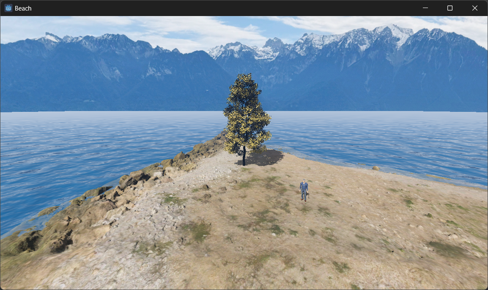
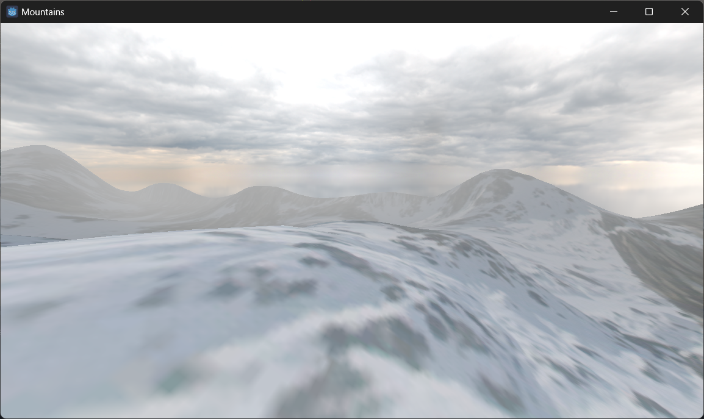
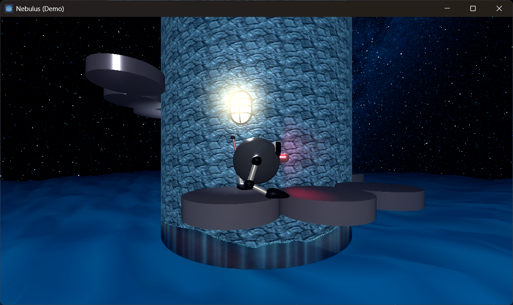
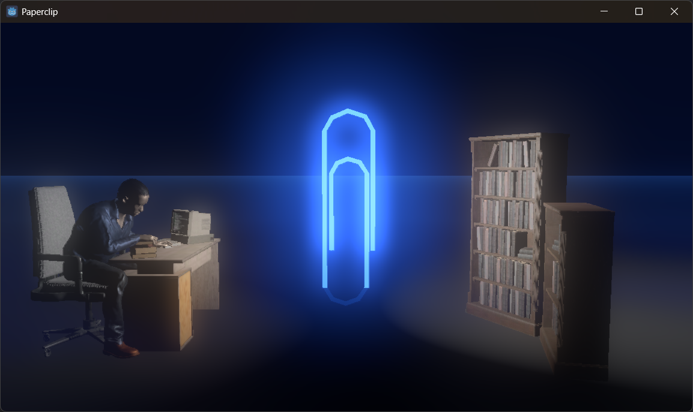
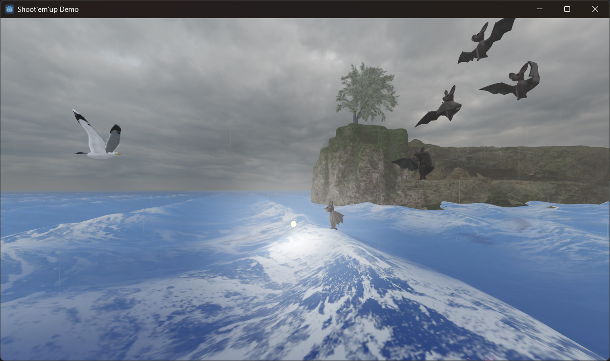
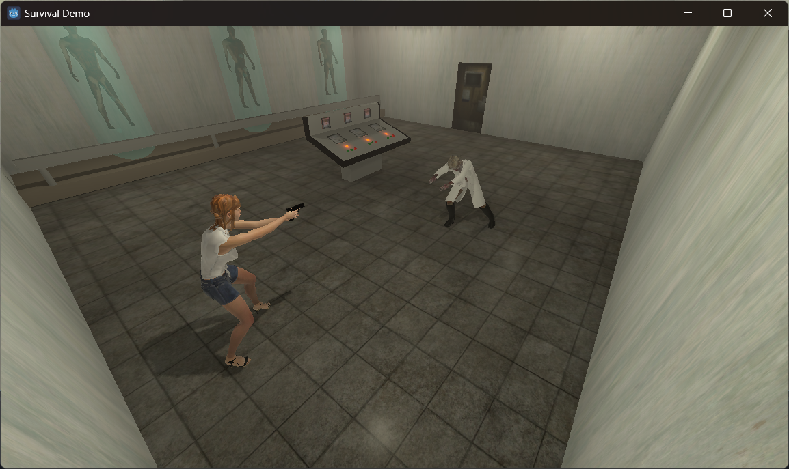

# Godot Engine
This repository contains several demo projects created with the Godot Engine.

## Demos
### Beach
Demo testing some natural assets like water, as well as how to constraint the player movements inside a navigable area.

### Mountains
This demo experiments a simple terrain generation based on heightmap, with a matching collider generated on runtime from a script.

### Nebulus
This demo exposes a base for a Nebulus game.

### Paperclip
This project is a simple ambient demo around an idea I have for a game.

### Shoot'em'up Demo
This project is a shoot'em'up demo, inspired on games like Agony for the Amiga.

### Survival demo
This is a small demo showing a survival game scene, where a character need to explore a laboratory.

